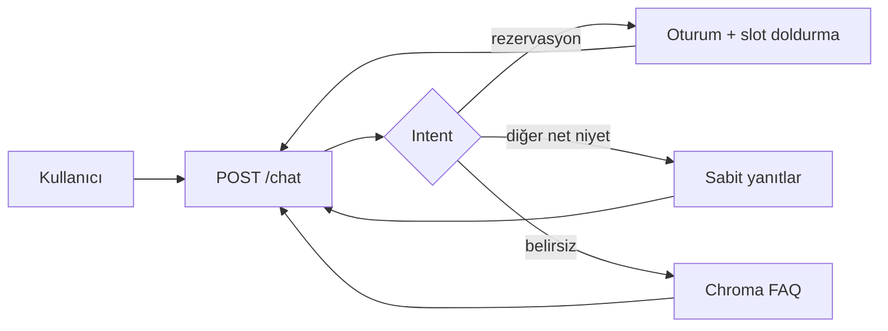

## Smart Hotel Chatbot

Otel rezervasyon süreçlerini destekleyen, **intent yönlendirme** + **FAQ RAG** (Chroma + Sentence Transformers) kullanan FastAPI tabanlı sohbet API’si ve basit web arayüzü.

### Özellikler
- TR/EN tetikleyicilerle intent: rezervasyon, iptal, fiyat, olanaklar
- Oturum (`session_id`) ile **demoda rezervasyon akışı**: şehir → tarih aralığı → misafir sayısı → özet (gerçek ödeme yok)
- FAQ RAG (benzerlik eşiği `SIMILARITY_THRESHOLD`)
- `/health` ve kök dizinde sohbet arayüzü (geçmiş + yükleme durumu)

### Mimari (özet)



### Kullanıcı senaryoları (demo)
1. **Yeni rezervasyon**: “rezervasyon yapmak istiyorum” → şehir → “2026-04-10 - 2026-04-15” → “2” → özet metni.
2. **Politika / SSS**: “iptal politikası nedir?” veya “kahvaltı dahil mi?” → RAG ile `faq.json` cevabı.

### Local run
```
cd backend
python -m venv .venv
.\.venv\Scripts\activate
pip install -r requirements.txt
uvicorn app.main:app --reload --port 8001
```

- Arayüz: http://localhost:8001  
- Sağlık: http://localhost:8001/health  

### API örnekleri

**Sağlık**
```http
GET /health
```

**Sohbet** (aynı oturum için dönen `session_id`’yi tekrar gönderin)
```http
POST /chat
Content-Type: application/json

{
  "message": "rezervasyon yapmak istiyorum",
  "session_id": null
}
```

Örnek yanıt (özet):
```json
{
  "reply": "Hangi şehirde konaklamak istersiniz?",
  "intent": "booking",
  "sources": [],
  "session_id": "…uuid…"
}
```

### Testler
```
cd backend
pytest
```

### Docker
```
docker build -t smart-hotel-chatbot ./backend
docker run -p 8001:8001 smart-hotel-chatbot
```

### Environment
`backend/.env.example` dosyasını `.env` olarak kopyalayın:
- `MODEL_NAME`
- `SIMILARITY_THRESHOLD`
- `CHROMA_PATH`

`faq.json` içeriğini değiştirdiyseniz, eski vektörler kalksın diye `chroma_db` klasörünü silip uygulamayı yeniden başlatın (ilk açılışta yeniden doldurulur).
